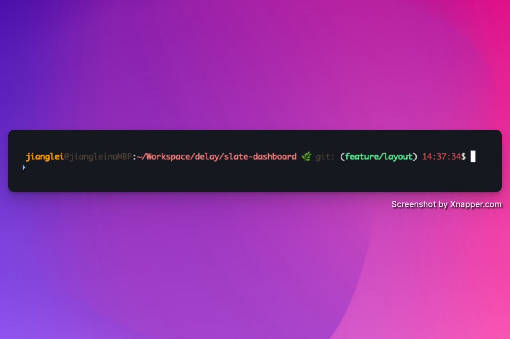

# Yellow Peach Theme

A warm and friendly zsh theme with git integration, featuring orange and pink color schemes.

## Screenshots




## Installation

1. Clone this repository into your oh-my-zsh custom themes directory:
```bash
git clone https://github.com/tomorrowbye/yellow-peach-theme.git ~/.oh-my-zsh/custom/themes/yellow-peach-theme
```

2. Symlink the theme file:
```bash
ln -s ~/.oh-my-zsh/custom/themes/yellow-peach-theme/src/yellow-peach.zsh-theme ~/.oh-my-zsh/custom/themes/yellow-peach.zsh-theme
```

3. Set the theme in your `.zshrc`:
```bash
ZSH_THEME="yellow-peach"
```

4. Reload your shell:
```bash
exec zsh
```

## Features

- Displays username, hostname and current directory
- Git branch integration with branch indicator
- Warm color scheme (orange, pink, etc.)
- Current time display
- Clean and minimal design

## Contributing

Contributions are welcome! Please follow these steps:

1. Fork the repository
2. Create a new branch for your feature
3. Commit your changes
4. Push to the branch
5. Submit a pull request

Please make sure your code follows the existing style and includes appropriate documentation.
